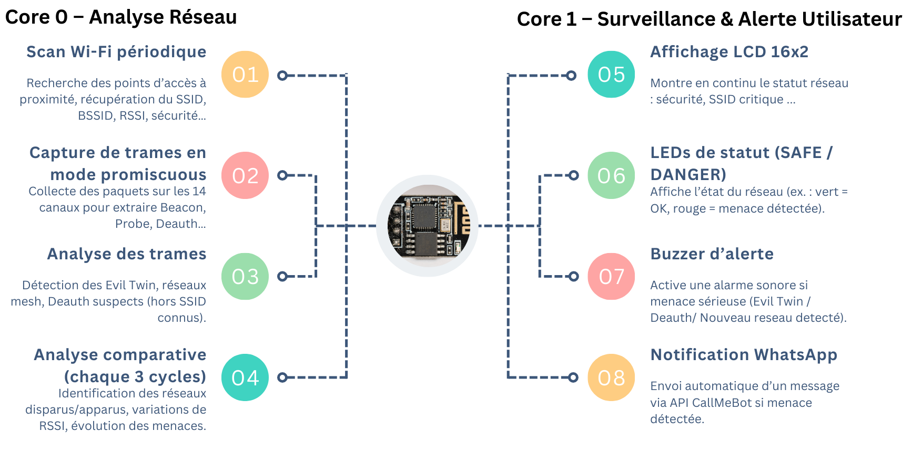
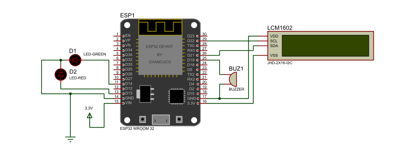
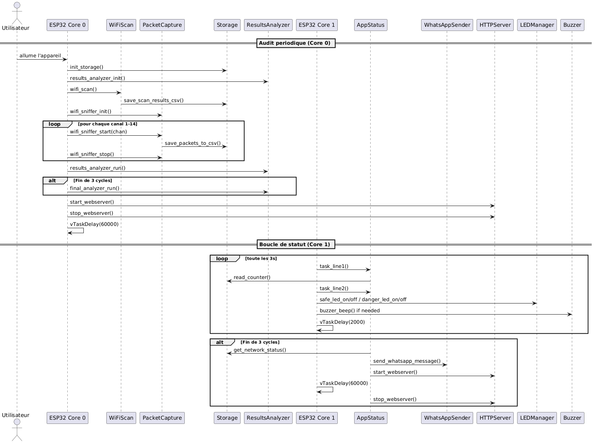

# 📘 Project Documentation: WiFi Security Analyzer & Attack Simulator (ESP32)

## 1. Introduction

In an era where wireless connectivity is everywhere, Wi-Fi network security remains a critical concern, especially for embedded and IoT systems. This project proposes a **fully autonomous open-source audit tool** based on the **ESP32 platform**, capable of performing real-time analysis and simulating Wi-Fi attacks in controlled environments.

### Objectives

- Provide a **lightweight, battery-powered, PC-free** Wi-Fi security auditing solution.
- Enable **real-time detection of common vulnerabilities**: Evil Twin, Deauthentication, Open Networks, etc.
- Offer a **modular, dual-core design** using ESP32 with FreeRTOS for concurrent processing.
- Emphasize **education and reproducibility** with full open-source availability.

## 2. System Architecture

The system consists of **two ESP32-based components**:

- `WiFi Analyzer`: performs scanning, detection, alerting, and reporting.
- `Attack Simulator`: generates real-time Wi-Fi threats for testing purposes.

### Functional Overview

| Core | Role |
|------|------|
| Core 0 | WiFi Scanning, Frame Capture, Local Analysis |
| Core 1 | LCD Display, LED/Buzzer Alerts, WhatsApp Notification, HTTP Server |

Each audit cycle runs every **60 seconds**, and comparative analysis is performed every **3 cycles**.

## 3. WiFi Analyzer Module

### Features

- Passive scan of 14 channels
- Detection of:
  - Evil Twin
  - Deauthentication frames (type 0xC0)
  - Hidden SSIDs
  - Open networks
  - Unauthorized channels (>11)
  - Appearance/disappearance of networks
  - Changes in RSSI/security
- Real-time alerts:
  - LCD I2C screen
  - Red/green LED indicators
  - Active buzzer
  - WhatsApp notification via CallMeBot
- Embedded HTTP server for viewing reports

---

## 🔌 ESP32 Wiring Diagram

---

## 📊 Sequence Diagram (WiFi Analyzer)

### Data Output

- Local file storage in **SPIFFS** (CSV format)
- HTML summary page with threat classification:
  - Critical Threats
  - Security Warnings
  - Network Changes
  - Secure Networks

## 4. Attack Simulator Module

Used to test the analyzer’s response under real conditions. This second ESP32 device simulates:

- 🔓 Open networks
- 📶 Evil Twin access points
- ❌ Deauthentication attack
- 📡 Unauthorized channel usage
- 🙈 Hidden SSIDs

Controlled via an **interactive menu** on the serial console.

## 5. Hardware Setup

- 2x ESP32-WROOM-32
- LCD I2C 16x2 Display
- 2x LEDs (green/red)
- 1x Buzzer
- Power: 3.3V (USB or external)

### Wiring (for Analyzer)

| Component       | GPIO |
|----------------|------|
| Green LED      | 14   |
| Red LED        | 13   |
| Buzzer         | 19   |
| LCD SDA        | 21   |
| LCD SCL        | 22   |

## 6. Software Stack

- **ESP-IDF** for low-level firmware development
- **FreeRTOS** for task concurrency
- **CallMeBot API** for WhatsApp messaging
- **SPIFFS** for internal file storage
- **StarUML** for modeling diagrams (UML)
- **GitHub** for version control and publishing

## 7. Methodology

A hybrid approach was adopted:
- **Dual-core task distribution**: Core 0 handles logic and scanning, Core 1 handles UI and networking.
- **Modular FreeRTOS tasks**: each function in its own task, with mutex protection for shared resources.
- **Incremental validation**: Each module was tested and validated before integration.
- **Iterative refinement**: Parameters and thresholds were tuned through experimental feedback.

## 8. Detection Criteria

| Threat              | Condition |
|---------------------|-----------|
| Evil Twin           | Duplicate SSID, different BSSID, higher RSSI |
| Open Network        | `authmode = 0` |
| Unauthorized Channel| Channel > 11 |
| Hidden SSID         | Empty SSID field, recurring MAC |
| Deauth Attack       | Multiple 0xC0 frames in short time |
| Network Change      | Network appears/disappears between cycles |

## 9. License & Availability

This is an **open-source project under the MIT License**.  
Everything is available on GitHub, including:
- Source code (WiFi analyzer & simulator)
- Wiring diagrams
- Ready-to-run binaries
- Reproducible test scenarios

> ✅ GitHub Repository: https://github.com/loueybouachir/wifi-security-esp32

## 10. Educational Use Notice

This tool is developed for **educational and academic research only**.  
It must **not** be used in public or unauthorized networks. The authors bear **no responsibility** for any misuse.
